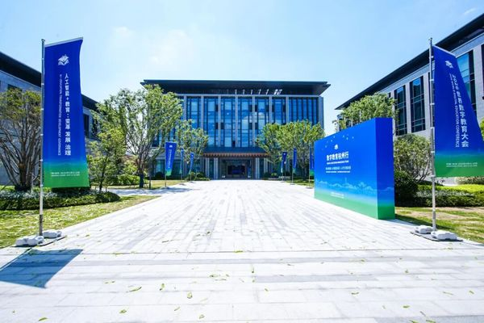
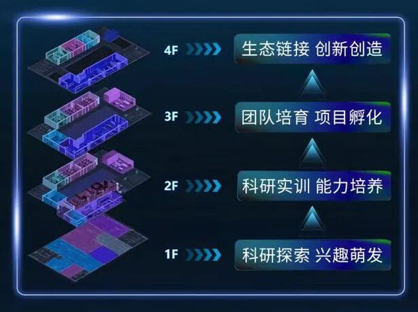
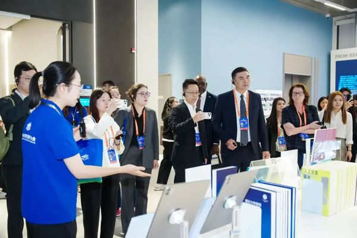

# 浙大这栋让全球高校都“酸了”的新楼里，Delta X 在做什么？

## 01 先用一段话，说清 Delta X

Delta X 迭代未来，是浙江大学启真交叉学科创新创业实验室（ZJU X-Lab）创投生态中面向市场侧的孵化平台。我们聚焦 **AI＋高校**：找到校园里真正有潜力的年轻人和项目，链接产业命题、市场与资本，帮助一个技术、一件作品或一个 Demo 跨过从“做出来”到“有人用”、从校园创新到商业闭环的断点。

## 02 浙大这栋新楼，为什么让人“酸了”

5 月 11 日，2026 世界数字教育大会在杭州开幕。全球教育专家、大学校长与政策制定者来到浙江大学未来学习中心——一栋位于本科生院旁、约 4000 平方米的四层楼。

有人这样形容它：**“浙大这个新楼，让全世界的大学都酸了。”** 不是因为它有多豪华，而是因为它真的想明白了：大学不应只教人读书，还要给年轻人创造的机会。

四层楼，讲了一个完整的成长故事：一楼是“玩”，用 AI 复现前沿科研，萌发兴趣；二楼是“做”，把真实工程场景搬进课堂，让想法变成实物；三楼是“赛”，由学生自主运营 X-Lab 社区，在竞赛和朋辈协作中孵化项目；四楼是“创”，连接开源协作、AI 共创、黑客松与创业孵化。

从兴趣到能力，从竞赛到创业，**玩—做—赛—创，一条路走到底。** AI 也不再是几个演示项目，而在成为每个学生学习与创造的基础设施。

## 03 在未来学习中心，Delta X 做什么

Delta X 已入驻未来学习中心。对我们来说，入驻不是多了一个空间，而是把市场侧的真实问题和支持带到离学生更近的地方。

**链接市场资源。** 让项目尽早遇见真实用户、产业场景与需求反馈，回答“谁需要它、为什么需要它”。

**链接资本资源。** 为处于合适阶段的团队连接早期资本与创投生态，帮助创业者理解融资逻辑、讲清项目价值。

**推动产业孵化。** 陪伴团队从 Demo、比赛或路演继续向前，把技术变成产品，把一次展示变成持续验证与迭代。

围绕项目的具体需要，我们也提供产业命题、技术基建、团队招募、创业活动与生态链接等支持。我们不替年轻人规定答案，只帮助他们更快找到下一个值得验证的变量。

## 04 从“会读书”到“会创造”，差的是机会

未来学习中心想做的，是把“会读书的人”培养成“会创造的人”。这句话之所以动人，是因为它把大学的角色说得很清楚：知识随处可得，而大学真正不可替代的，是提供环境、同伴和机会，让年轻人发现兴趣、解决问题，并走向真实世界。

未来学习中心提供这样的环境；Delta X 则站在市场一侧，接住其中有潜力的创造，把它继续推向用户、资本与产业。

从学习到创造，从想法到产品，从校园到市场——我们希望每一个敢于行动的年轻人，都能找到属于自己的增量。

让改变真实发生。和 Delta X 一起，迭代未来。

> 图片来源：[浙江大学官方报道《Future learning center opens at Zhejiang University》](https://www.zju.edu.cn/english/2026/0515/c19573a3162908/page.htm)
